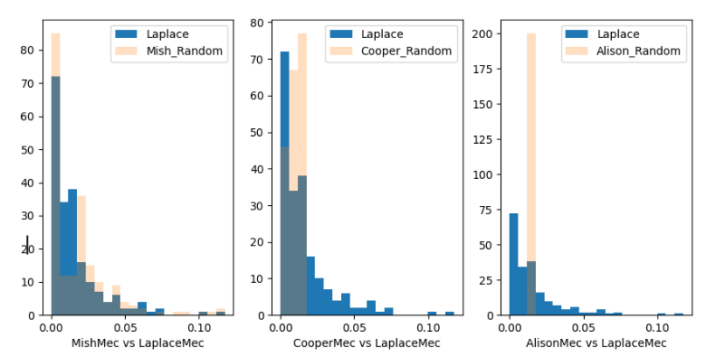

# CS 3110: Data Privacy Final Project

## Randomization Functions vs Laplace

### Who is in Our Group:
Alison Gilpatrick, Mish Wilson, Cooper Sullivan

### Project Statement:
We are planning to look at previous randomization algorithms that each of us came up with in Advanced Programming and compare them to the Laplace and Gaussian mechanism to see how they hold up against these more modern and optimized noise generators. We’re planning to use the adult dataset and use Laplace, Gaussian, and our random noise generators to add noise to our answers, then graphing the results similar to how the output for Question 1 on exercise 10-02-23 is formatted.

### Description of your Solution (Should allow reader to reproduce):
Our solution involves putting all three of our random algorithms into individual C++ .cpp files and adapting them so that they run 200 times, adding the noise they generate to the original answer. We then imported the adult.csv file and Laplace mechanism from our exercise into a python file (called noise_battle.py), and ran “pip install -U -r requirements.txt” in the terminal on Clion to download all requirements. Then we set up our python script to call C++ files in the command line and read the outputs into a variable. The file is also set up so that it runs regardless of what kind of computer you are using (Windows, Mac, and Linux). Then we took the output and applied it to a graph against Laplace so we could compare. Finally to run the code we go back to Clion’s terminal and run “python noise_battle.py”, which will display the three graphs.

For testing purposes, if you need to run the .cpp files you can go to Clion’s terminal and run “g++ (Name of .cpp file) -o a” to make the executable (Which you should do every time you change the .cpp file) and then run “./a” to actually run the file.

### Description of Results:

We found that Mish’s algorithm was by far the closest to the Laplace Mechanism, with Cooper’s being close to the first half of the values, and mine (Alison’s) getting the same number every time. Cooper’s graph tends to be inconsistent in the answers it gives. The reason that mine gets the same number every time is because it is heavily based on time, and the python code runs so fast with only 200 runs that the time it gets is the same, making all the answers the same.

